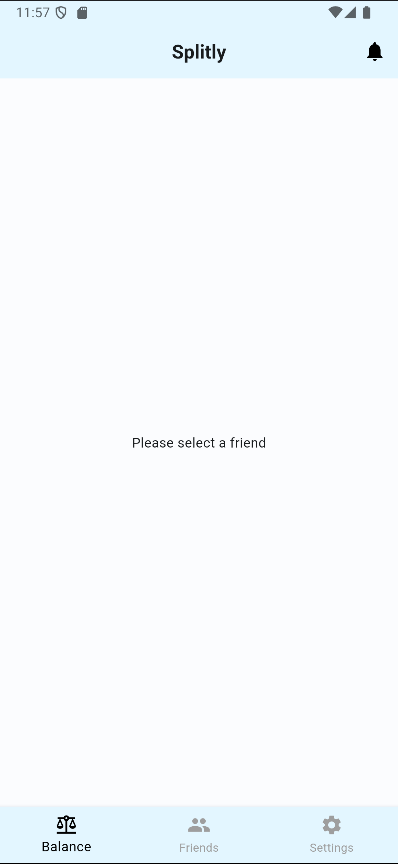
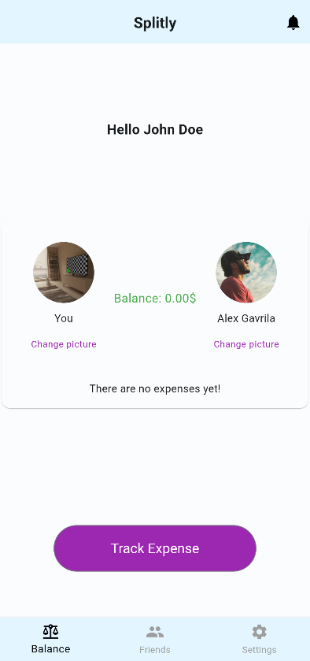
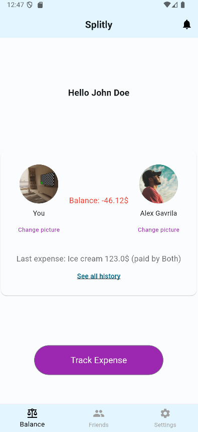
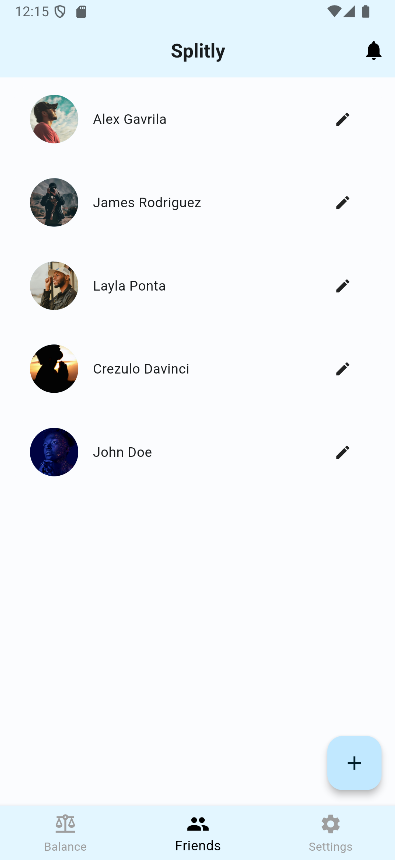
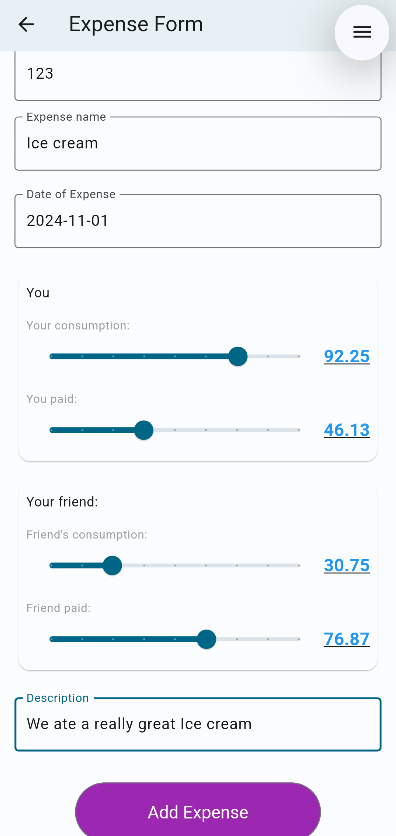

# Splitly

Splitly is an intuitive expenses tracker designed for couples and friends. Keep track of shared expenses, maintain a clear balance between friends, view expense histories, and much more — all in one place!

## Table of Contents

- [App Introduction](#app-introduction)
  - [Balance Page](#balance-page)
  - [Friends Page](#friends-page)
  - [Tracking Expenses](#tracking-expenses)
- [Getting Started](#getting-started)
- [Features](#features)
- [License](#license)

---

## App Introduction

Splitly makes it easy to track shared expenses, ensuring transparency and fairness in your financial interactions with friends and partners. Whether you're splitting dinner, rent, or groceries, Splitly keeps everything organized for you.

### Balance Page

The Balance page provides a detailed overview of the current balance with a friend, showing all expenses that contribute to the amount owed or due.

- **No Friend Selected** - A reminder to select a friend to begin tracking.
- **Balance Overview** - See a detailed balance sheet for expenses shared with a selected friend.
- **New Expenses** - Instantly track and adjust balance when a new expense is added.

<p align="center">
  
  
  
</p>

### Friends Page

View, add, and manage friends from this page. With the Friends Page, you can easily start tracking expenses with anyone in your circle.

<p align="center">
  
</p>

### Tracking Expenses

Keep track of each expense, whether shared or individual, and categorize them for easy reference later.

<p align="center">
  
</p>

---

## Getting Started

To get started with Splitly, clone this repository and follow the instructions below.

```bash
git clone https://github.com/your-username/splitly.git
cd splitly
```

Ensure you have Flutter installed, then run:
```bash
flutter run
```

## Features
- **Real-time Balance Tracking**: View and update balances between friends or partners.
- **Expense History**: Easily reference and filter past expenses.
- **Friend Management**: Add or remove friends, and start tracking balances with any friend.
- **Undo & Redo Actions**: Quickly adjust mistakes with undo and redo functionalities.

## License
This project is licensed under the MIT License.